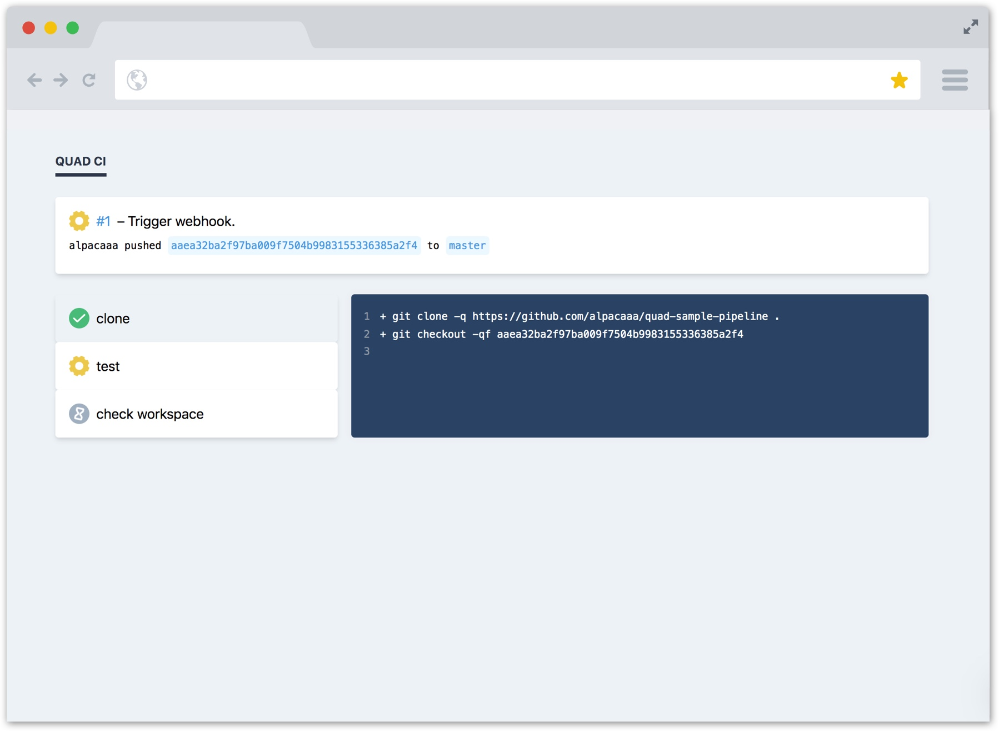

# Quad CI

Quad CI is a _simple_ Continuous Integration system written in Haskell.

### Features

- sandboxed builds in docker containers
- a multi-node architecture with agents picking up jobs to work on
- an http api to interact with the frontend and other nodes
- support for triggering builds with github webhooks



### Getting Started

```bash
stack build

# Run server
stack run -- start-server

# Run agent
stack run -- start-agent
```

Try running a simple build:

```bash
$ curl -X POST -H "Content-Type: application/json" -d
@test/github-payload.sample.json "http://localhost:9000/webhook/github"

```

Quad CI comes with a web UI, which can be accessed at `http://localhost:3000`. To install it, run the following:

```bash
cd frontend/
yarn
yarn next
```

### Architecture

Single server - multiple agents.

TODO say more

### Codebase overview

- `src/Core.hs`  
  Domain types (`Build`, `Pipeline` etc.) along with main state machine (`progress`)
- `src/Docker.hs`  
  Talks to Docker api
- `src/Runner.hs`  
  Runs a single build, collecting logs (`Core.collectLogs`) and processing state updates (`Core.progress`)
- `src/JobHandler.hs`  
  Introduces `Job` type, which is just a `Build` that can be _queued_ and _scheduled_
- `src/JobHandler/Memory.hs`  
  An in-memory implementation of `JobHandler`, built on top of STM
- `src/Github.hs`  
  Talks to Github api
- `src/Agent.hs`  
  Agents ask the server for work to do, run builds (`Runner`) and send updates back to the server
- `src/Server.hs`  
  The server collects job to be run (when receiving webhook events). It keeps an internal job queue (`JobHandler`) exposed as an http api (used by web ui)
- `src/Cli.hs`  
  Main entrypoint. Calls either `Server.run` or `Agent.run`
- `src/Socket.hs`  
  Low-level code to send http requests to a socket. Not interesting, can be ignored.

### Why?

TODO expand on this

An approachable codebase at just 1000 lines of Haskell code.

Real world example of Haskell application.

Show what Simple Haskell looks like.
